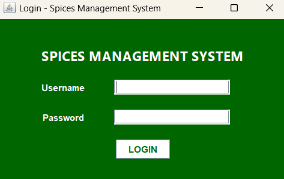
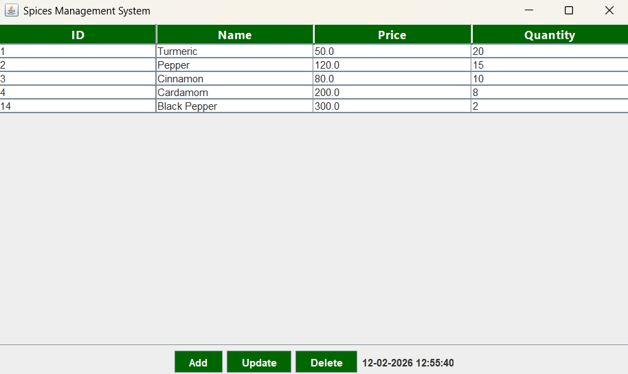
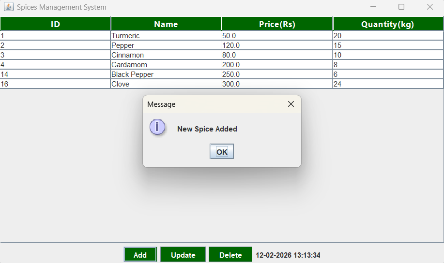
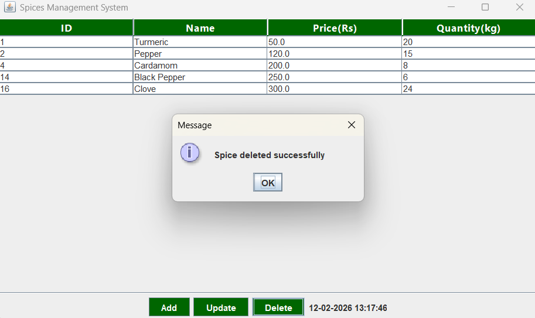

# Spices-Management-System-Application
A Mini Real-World Java Application for Spice Inventory Management, demonstrating OOP principles, Swing GUI, JDBC, and Multithreading. Developed as part of the 244SECUBC201 Object Oriented Programming Using Java course.

# Spices Management System

**Course:** 244SECUBC201 – Object Oriented Programming Using Java
**Course Outcome:** CO5 – Develop and execute Java programs implementing OOP principles, GUI components, exception handling, multithreading, and database connectivity using JDBC.

---

## 1. Project Overview
The **Spices Management System** is a real-world mini-application designed for retail spice inventory management. It features a secure login system and a full management dashboard to track stock levels, pricing, and product details.

### Team Members
* **Sreya S Saji** – 24UBC260
* **Alkha Mariam Mathew** – 24UBC210

---

## 2. Problem Definition & Objective
**Problem Statement:** Manual inventory management in small shops leads to stock mismanagement and data inconsistency.
**Objective:** To automate record-keeping using a Java Swing GUI and a MySQL database to ensure data integrity and user-friendly interaction.

---

## 3. OOP Design & Implementation
This project strictly implements the following Object-Oriented principles:
* **Abstraction:** Defined in the `abstract class Product`.
* **Inheritance:** The `Spice` class extends the `Product` class.
* **Encapsulation:** Used via private/protected fields and public getter/setter methods.
* **Polymorphism:** Overriding the `getCategory()` method in subclasses.


---

## 4. Technical Features (CO5)
**GUI Components:** Developed using **Java Swing** (JFrame, JTable, GridBagLayout).
**Database Connectivity:** Uses **JDBC** with PreparedStatement for secure CRUD operations.
**Multithreading:** A background thread manages a real-time digital clock on the dashboard.
**Exception Handling:** Manages `SQLExceptions` and `NumberFormatExceptions` for robust performance.

---

## 5. Steps to Run the Program
To verify the output during lab evaluation, follow these steps:
1. **Clone the Project:** Use `git clone https://github.com/alkha-mariam/Spices-Management-System-Application.git`.
2. **Open IDE:** Open the folder in **NetBeans** or **IntelliJ IDEA**.
3. **Set JDK:** Ensure your project is using JDK 8 or higher.
4. **Run:** Locate the main Java file (e.g., `Main.java`) and click **Run**.
5. **Database:** If using JDBC, ensure your MySQL/local database is active.

---


## 5. Database Setup (SQL)
To run this project, create a database named `spices_db` and execute the following scripts:

```sql
CREATE DATABASE spices_db;
USE spices_db;

CREATE TABLE spices (
    id INT PRIMARY KEY AUTO_INCREMENT,
    name VARCHAR(100) NOT NULL,
    price DOUBLE NOT NULL,
    quantity INT NOT NULL
);

CREATE TABLE users (
    id INT PRIMARY KEY AUTO_INCREMENT,
    username VARCHAR(100) NOT NULL UNIQUE,
    password VARCHAR(100) NOT NULL
);

-- Default Credentials
INSERT INTO users (username, password) VALUES
('admin', 'admin123'),
('alkha', 'alkha123'),
('sreya', 'sreya123');;

```
---

## 6. Conclusion
The **Spices Management System** successfully integrates OOP principles with a functional GUI. [cite_start]By implementing exception handling and multithreading, the project meets the **CO5** course outcomes for developing real-world Java applications.

---


## 7. Screenshots
Below are the key interfaces of the Spices Management System Application:

### Login Screen


### Dashboard


### Add Spice


### Update Spice


### Delete Spice

